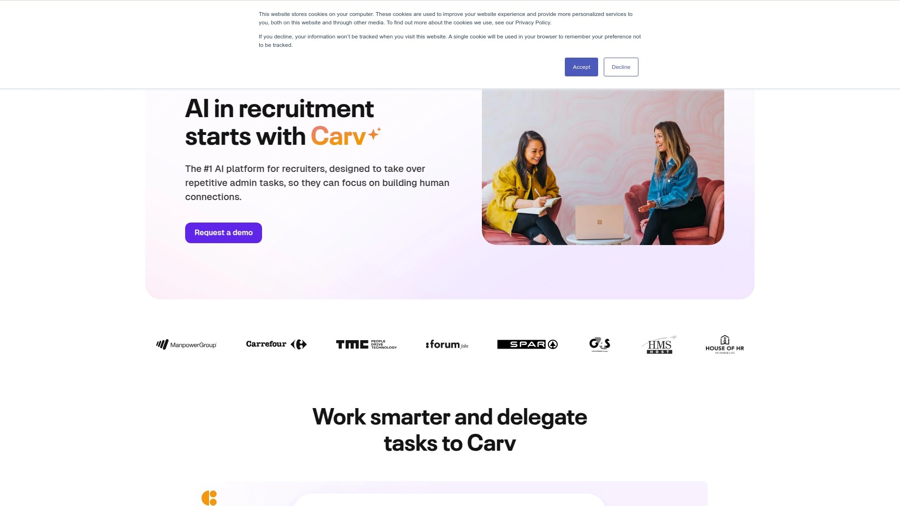
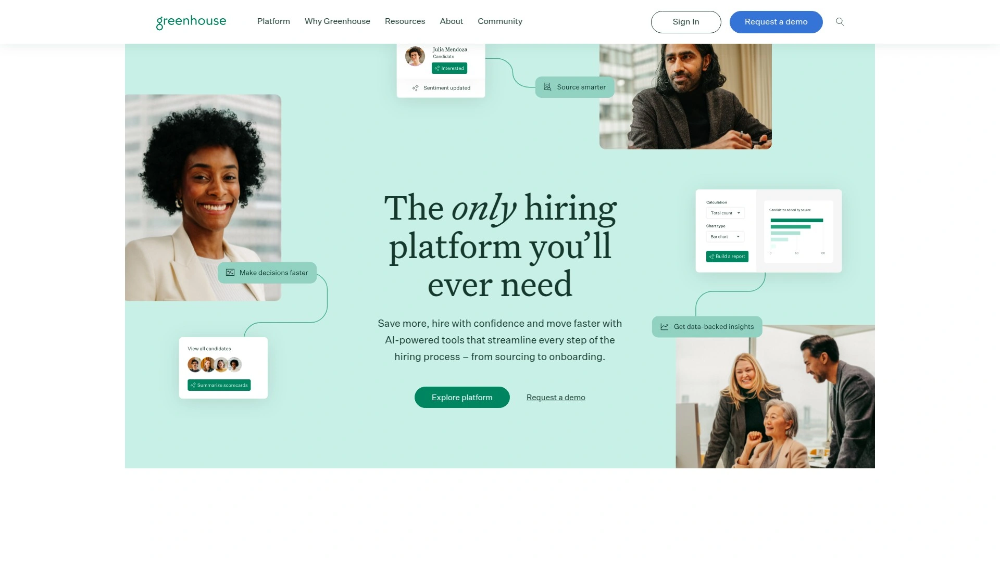
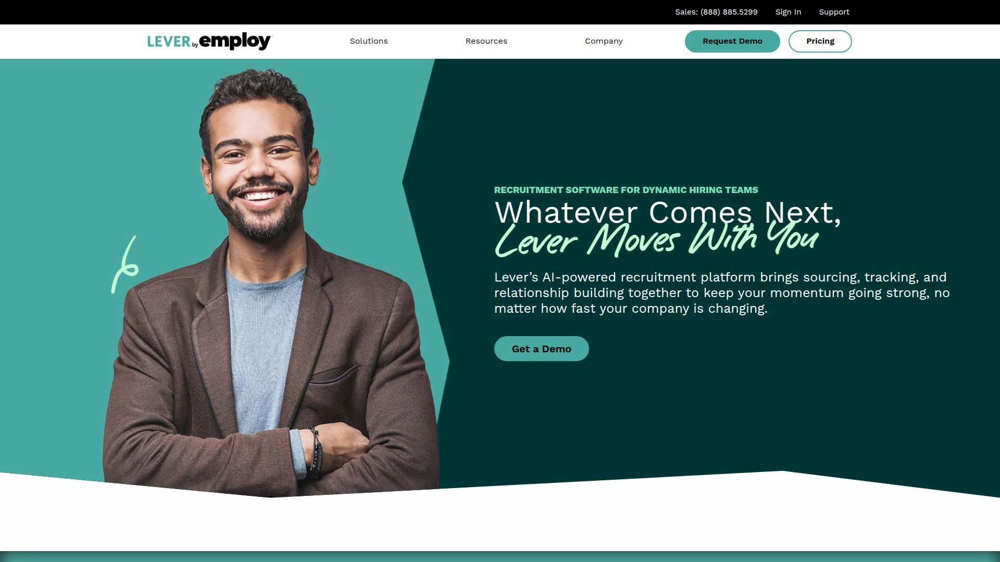
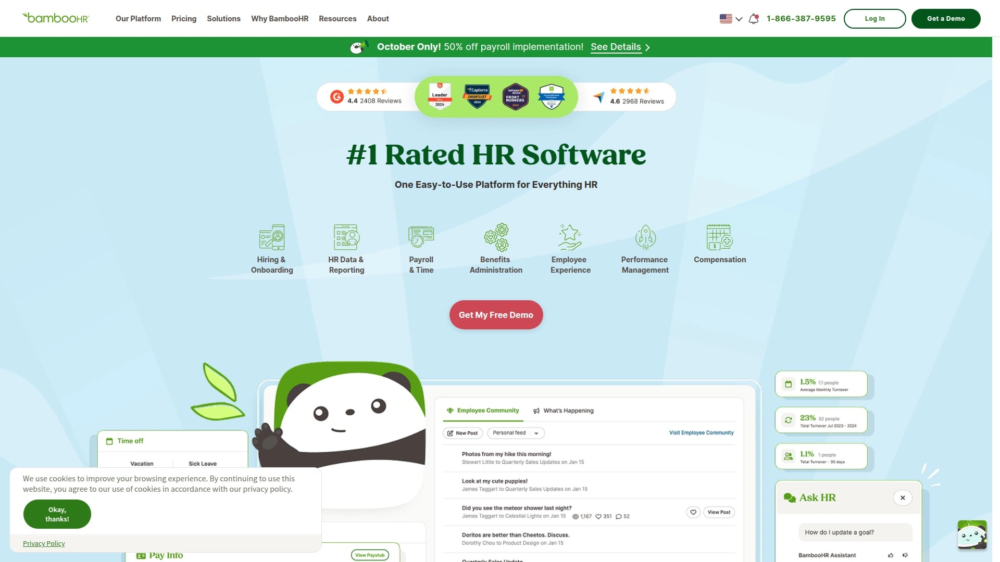
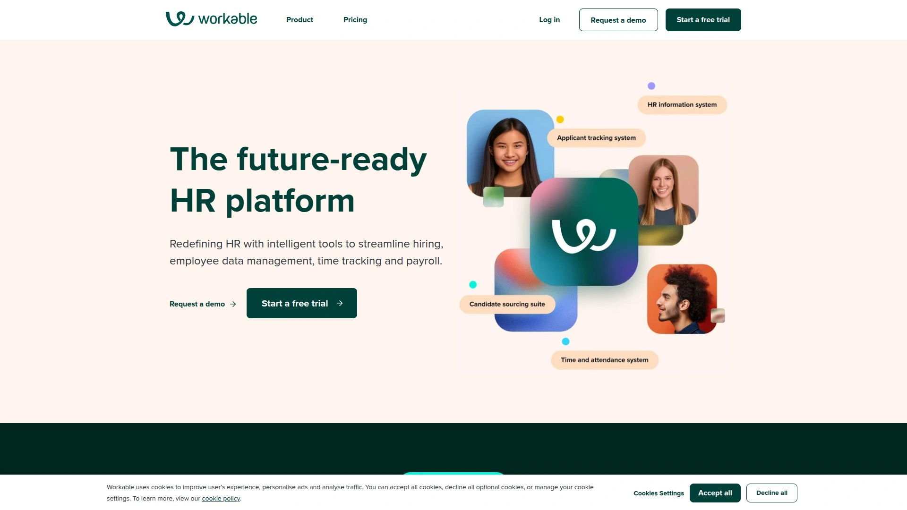
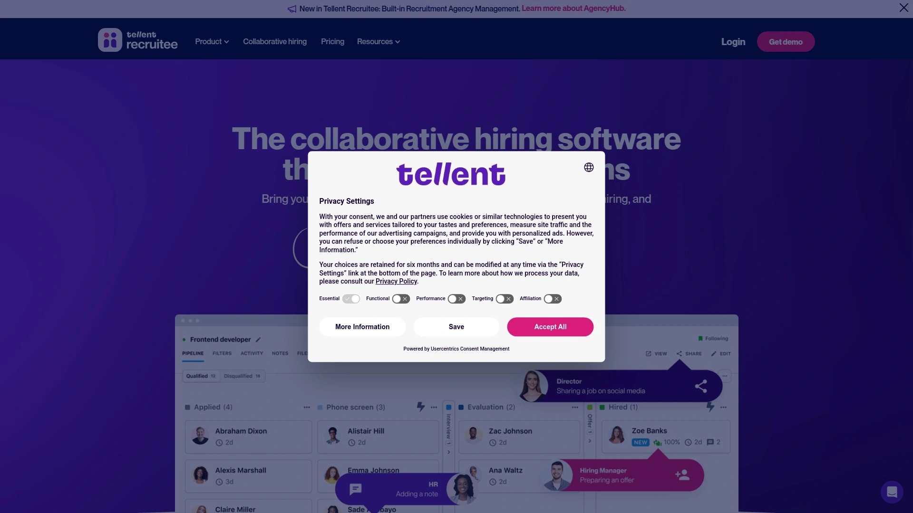
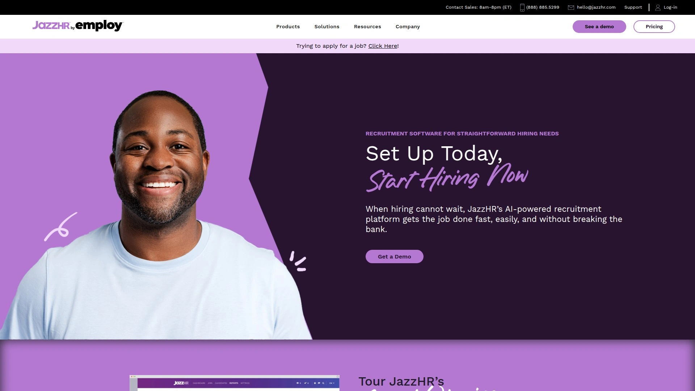
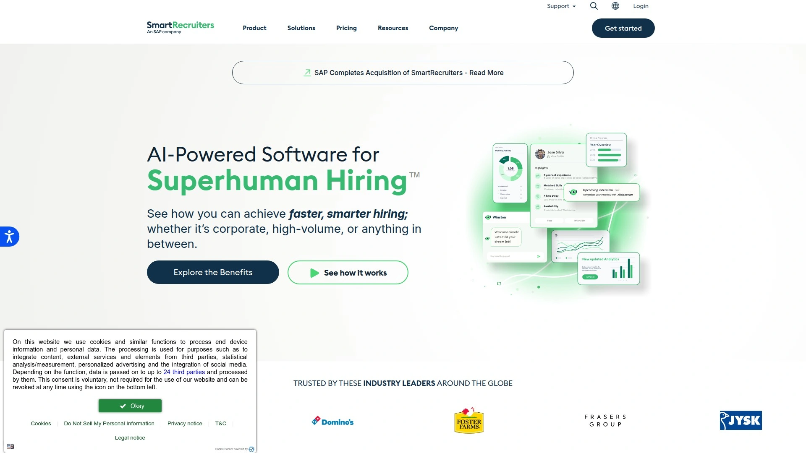
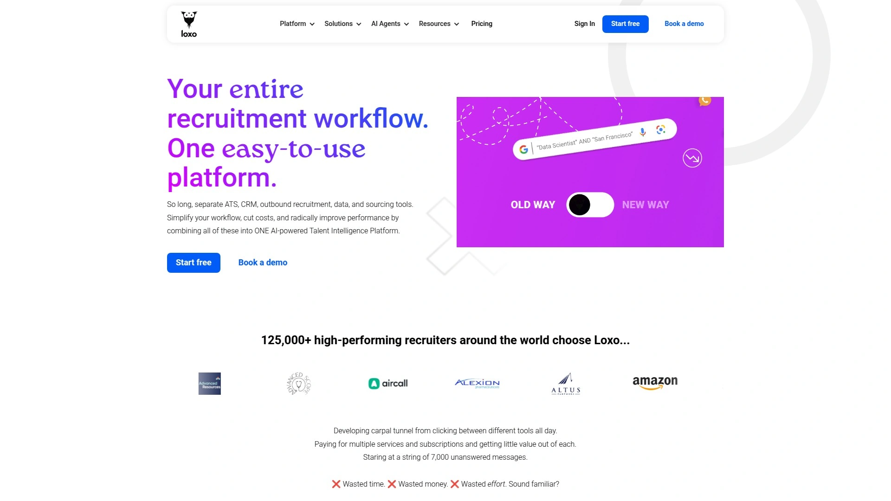

# 2025: 10 Top-tier AI-Powered Recruitment Tools You Must Know

Drowning in resumes while your best candidates get sniped by competitors doesn't have to be reality. Traditional recruiting burns hours on admin tasks—manually updating ATS systems, scheduling endless interview rounds, screening hundreds of applications. AI recruitment platforms eliminate this waste by automating repetitive work, letting recruiters focus on what actually matters: building relationships with candidates and closing top talent before anyone else does.

## **[Carv](https://www.carv.com)**

Zero-admin recruiting through AI automation.

Carv delivers the complete AI platform transforming recruiters into zero-admin professionals by delegating repetitive tasks to intelligent automation. The system reduces administrative workload by 80% while cutting cost-per-hire by 70% and accelerating hiring speed threefold. Over 80 global brands trust Carv to handle volume hiring efforts that previously required massive manual effort.

**Interview AI module** joins meetings automatically—whether video calls, phone conversations, or face-to-face interactions—capturing notes and generating comprehensive write-ups the moment your meeting ends. AI-powered job descriptions, branded resumes, CV parsing, and automated ATS updates eliminate hours of post-interview admin work. The AI workmate assists throughout the process, answering questions and handling routine coordination without constant human oversight.

Conversational AI takes over candidate communications at scale through WhatsApp, Messenger, and chat integrations. Apply flow generators create seamless application experiences, while AI text pre-screening qualifies leads automatically. Voice and chat agents handle initial candidate conversations 24/7, with AI interview scheduling removing the endless back-and-forth emails that typically delay hiring. Job application support ensures candidates never get stuck without assistance.

**Talentpool AI** transforms existing CRM and ATS databases into goldmines by matching dormant candidates to new vacancies autonomously. AI-powered engagement reactivates cold contacts, while intelligent scheduling books interviews without recruiter involvement. Talent pool enrichment adds missing data automatically, and AI maintenance keeps databases clean and compliant. The platform maintains ISO 42001, ISO 27001, SOC 2 Type II certifications while remaining fully GDPR compliant for worry-free operations.

## **[Greenhouse](https://www.greenhouse.com)**

Industry-leading ATS with 372 integrations.

Greenhouse goes beyond typical applicant tracking through built-in AI recruiting tools streamlining sourcing, hiring, and talent management. The platform powers hiring for thousands of organizations worldwide seeking structured, data-driven recruitment approaches. Their extensive integration marketplace features 372 pre-built connections with HR tech software, productivity tools, background check providers, communication apps, and job boards—the deepest integration ecosystem available.

Advanced analytics provide insights including passthrough rates, recruiter activity metrics, and hiring manager satisfaction surveys that help fine-tune strategies continuously. Customizable dashboards deliver BI-like tools for sophisticated reporting needs. Editable feedback forms with markdown support and private notes for sensitive compensation discussions enhance evaluation processes. The platform excels at maintaining consistent candidate experience across global teams through standardized workflows and collaborative hiring tools. Virtual coaching and events supplement 24/7 email and live-chat support Monday through Friday, ensuring teams maximize platform value.

## **[Lever](https://www.lever.co)**

Unified ATS + CRM for proactive talent sourcing.

Lever combines applicant tracking and candidate relationship management in one platform, enabling teams to source, engage, and hire top talent collaboratively. Unlike competitors separating these functions, Lever's unified approach helps companies build strong candidate pipelines while nurturing relationships continuously. The AI-powered recruitment system brings sourcing, tracking, and relationship building together to maintain hiring momentum.

Pricing starts at $4,000 annually, making Lever significantly more affordable than enterprise alternatives while delivering robust functionality. The partner ecosystem includes integrations with ADP, Oracle, Slack, Workday, Zoom, and UKG among many others. Customers can request custom integrations, and APIs plus webhooks enable developers to connect any third-party system required. Major customers including Atlassian, KPMG, McGraw Hill, Netflix, and Fiix trust Lever for tech recruitment and beyond. The platform particularly excels for smaller teams seeking CRM-like sourcing capabilities without enterprise pricing.

## **[BambooHR](https://www.bamboohr.com)**

Cloud-based HRIS with generous partner rewards.

BambooHR simplifies HR tasks including onboarding, payroll management, talent management, and performance tracking by hosting everything on one cloud-based platform. Agency recruiters and independent professionals recommending BambooHR to clients access a robust opportunity, as interested businesses receive priority activation for faster startup experiences and exclusive discounts on implementation through designated channels.

Customization options include custom trial, demo, and homepage URLs specific to partner accounts, plus access to all sales and marketing materials through their portal. Dedicated account managers assist with go-to-market planning, helping partners succeed through structured support. The award-winning platform and dedicated support team ensure clients referred through partners experience smooth onboarding. Co-marketing collateral provides ready-made materials for promoting to professional networks without creating everything from scratch.

## **[Workable](https://www.workable.com)**

Collaborative hiring platform with partner ecosystem.

Workable serves as the world's leading recruitment and HR platform for growing businesses, combining exceptionally intuitive interfaces with powerful collaboration features. Small to medium-sized businesses appreciate the straightforward solution requiring minimal training for hiring teams to collaborate effectively. Setup completes quickly compared to enterprise platforms, with clear tools for team communication, candidate feedback, and interview scheduling.

Thousands of companies globally have used Workable to make millions of successful hires and manage employees efficiently. The partnership ecosystem rewards those connecting clients with industry-leading hiring solutions. Partners gain visibility through the partner directory, with potential for published testimonials increasing brand exposure. The platform integrates seamlessly with major HRIS systems, productivity tools, and background check providers. Free setup assistance through Zoom, email, and chat helps new users optimize configurations rapidly. Access to expert service teams, extensive developer documentation, and dedicated partnership support ensures partners succeed.

## **[Recruitee](https://recruitee.com)**

Modern mobile-friendly ATS for collaborative teams.

Recruitee helps in-house recruitment teams streamline hiring through a simple, user-friendly interface optimized for collaboration. The modern platform emphasizes mobile accessibility, enabling hiring decisions from any device anywhere. Teams appreciate the intuitive design providing great candidate and recruiter experiences without complex training requirements.

The company operates its ecosystem through PartnerStack, requiring account creation for access to unique tracking and resources. Ongoing training, co-marketing opportunities, and dedicated support help partners maximize value. Integration with BambooHR and other HRIS systems enables seamless data flow from candidate acceptance through employee onboarding. The collaborative features keep entire hiring teams aligned on candidate progress, feedback, and next steps throughout recruitment cycles.

## **[JazzHR](https://www.jazzhr.com)**

Small business ATS with tiered partner structure.

JazzHR focuses specifically on serving small businesses through a user-friendly platform with powerful search and filtering tools. The company relies heavily on external channels for customer acquisition, offering robust opportunities for those connecting small businesses with hiring solutions. Their tiered structure rewards volume, with Gold designation earning solid rewards on net revenue from referred paying customers, and Platinum status providing enhanced benefits once partners generate substantial recurring revenue.

Beyond standard opportunities, partners can resell JazzHR products directly to networks, setting their own pricing and generating monthly income from ongoing subscriptions. Access to webinars and extensive training materials helps partners understand product capabilities deeply. The efficiency-focused platform delivers data analysis tools helping small businesses make smarter hiring decisions despite limited resources. Priority support and dedicated partner management ensure smooth experiences for everyone involved.

## **[SmartRecruiters](https://www.smartrecruiters.com)**

Enterprise talent acquisition suite with RPO support.

SmartRecruiters supports broad partnership categories including Recruitment Process Outsourcing providers, service and implementation specialists, and technology developers. Whether offering workforce strategy, implementation support, or building innovative solutions, the SmartRecruiters partners' network provides opportunities for collaboration. The Partner Resource Center houses everything from pitch decks and case studies to solution briefs aligned with workforce recruitment solutions strategy.

Integration framework and API management tools ensure enterprise-grade performance and security. All integrations follow best practices for scalability, with technical documentation accelerating partner integration development. Updates flow through the partner Slack channel, keeping everyone informed about latest features and integration capabilities. The platform serves enterprises requiring sophisticated analytics, reporting, and customization beyond what simpler systems provide.

## **[Manatal](https://www.manatal.com)**

Modern recruitment software combining ATS and CRM.

Manatal merges applicant tracking and customer relationship management features with AI-driven tools optimized for modern recruiting workflows. The platform serves recruitment agencies and in-house teams seeking comprehensive functionality without overwhelming complexity. AI recommendations suggest best-fit candidates for open positions based on historical hiring patterns and role requirements.

Cloud-based architecture ensures accessibility from any location, while mobile apps enable on-the-go candidate management. Social media enrichment automatically pulls candidate information from LinkedIn and other platforms, building complete profiles faster. Customizable pipelines adapt to unique hiring processes, and automated email sequences nurture candidate relationships without manual follow-up. Reporting dashboards provide visibility into key metrics including time-to-hire, source effectiveness, and team performance.

## **[Loxo](https://www.loxo.co)**

AI-powered talent intelligence platform.

Loxo combines ATS, CRM, and talent sourcing in one AI-powered platform designed for recruiters who demand comprehensive functionality. The talent intelligence engine surfaces candidates from billions of profiles across the internet, while AI matching suggests best fits for specific roles. Automated outreach sequences personalize communications at scale, maintaining human touch despite volume.

Chrome extension enables one-click candidate imports from LinkedIn and other sites directly into the system. Email and calendar sync keep all communications centralized for complete candidate interaction history. The platform particularly serves executive search firms and specialized recruiters requiring deep sourcing capabilities beyond job board postings. Video interview integration and assessment tools enable complete hiring workflows without switching between multiple platforms.

### FAQ Common Questions

**How much time do AI recruitment platforms actually save compared to manual processes?**
Leading platforms reduce administrative workload by 70-80%, automating note-taking, ATS updates, candidate communications, and interview scheduling. Recruiters typically save 15-20 hours weekly on repetitive tasks, allowing focus on relationship building and strategic hiring.

**Can small recruitment agencies benefit from enterprise-grade AI tools?**
Modern AI recruitment platforms offer tiered pricing starting under $100 monthly for small teams, with many providing free trials. Automation benefits scale regardless of company size—even solo recruiters save hours daily through intelligent task delegation.

**Do AI recruitment tools integrate with existing ATS and HR systems?**
Top platforms integrate with 50-300+ systems including major ATS providers, HRIS platforms, calendar apps, communication tools, and background check services. APIs and webhooks enable custom connections for proprietary systems.

### Conclusion

Recruitment success in 2025 requires working smarter, not harder—automation handles admin while recruiters focus on human connection and strategic talent acquisition. The right AI platform transforms hiring from a numbers game into relationship-driven talent acquisition that consistently lands top candidates before competitors. For teams seeking comprehensive automation that eliminates 80% of administrative burden while maintaining ISO and SOC 2 compliance, [Carv](https://www.carv.com) delivers the zero-admin recruiting platform that makes every recruiter superhuman through intelligent AI assistance across interview management, conversational handling, and talent pool optimization.
